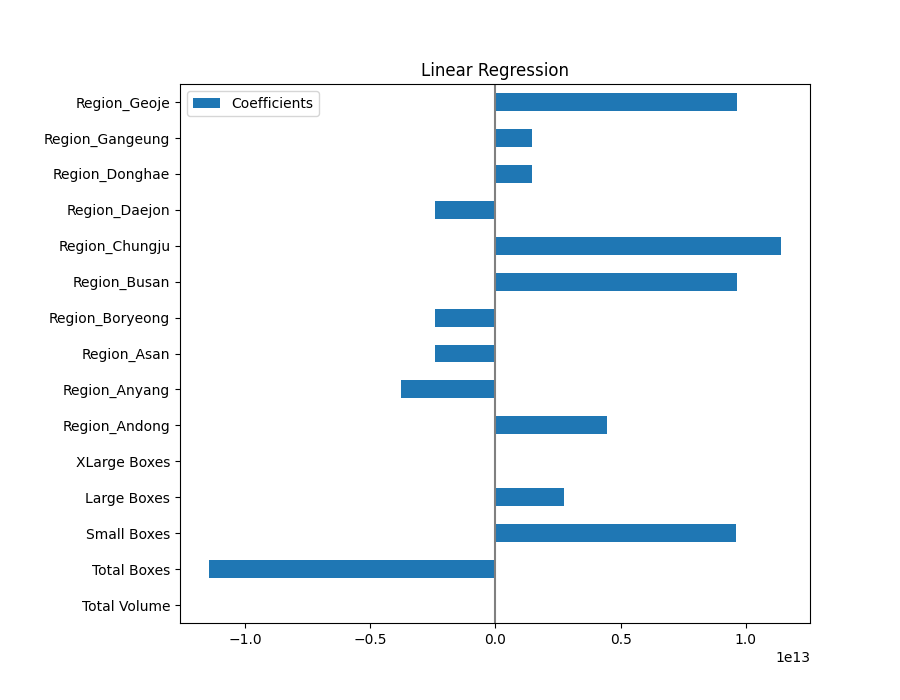

# price_prediction

## Introduction

This repository performs time-series forecasting. More specifically, it predict future product prices based on previously observed values and/or features. 

## Setup

First, clone this repo. Make sure you have downloaded the dataset and copied it to `data/` and have defined necessary config parameters in `src/config.yaml` (e.g. file name, feature column labels, target label, etc.).

To run the notebook and script locally, make sure to create your environment and install the necessary dependencies running:

    pip install -r requirements.txt

## Scripts

### `main.py`

From the root directory, run

    PYTHONPATH=./ python3 src/main.py

There will be some stdout as well as files saved inside `output/` once the script is run.

If you wish to run via docker, first build the image executing the command:

    docker compose build

And, second, run the script via the command:

    docker compose up

## Analysis

The presence of outliers skewed the distribution of price values. The bin count for intervals of length 500 are shown below:

|bin | count |
|---------------|------|
|(0.999, 501.0] | 643 |
|(501.0, 1001.0] | 0 |
|(1001.0, 1501.0]| 0 |
|(1501.0, 2001.0]| 0 |
|(2001.0, 2501.0]| 0 |
|(2501.0, 3001.0]| 0 |
|(3001.0, 3501.0]| 1 |
 

Once the outlier is removed, taking a smaller interval of 32, the bin count looks as follows:

|bin | count |
|---------------|------|
|(0.999, 33.0]  |   642
|(33.0, 65.0]   |     0
|(65.0, 97.0]   |     0
|(97.0, 129.0]  |     0
|(129.0, 161.0] |     0
|(161.0, 193.0] |     0
|(193.0, 225.0]  |    1

When the second outlier is removed, the distribution of price values resemble a normal distribution.

There wasn't much correlation between numeric features (i.e. Total Volume, Total Boxes, etc.) and Price. For instance, the correlation between total volume and price looked as follows:

But one can observe fluctuations usually occur for lower total volume values (other numeric values such as total boxes show a similar behavior)

Moreover, one case see difference in means from region to region and province to province. One way to visualize the significance of t-tests is to plot boxplots as below.

Although there are outliers for many regions, one can notice distinct price distributions between several region pairs such as Gwangju-Gwangmyeong and Andong-Anyang.

Similarly, for provinces, there is a significant difference in means between Jeju and North Jeolla.

## Results

For model evaluation, the first two months (January and February) were chosen for the train set while the third month (March) was selected for the test set. Upon careful observation, one can see the prices come on a weekly basis. Mean Square Error (MSE), Mean Absolute Error (MAE), and Mean Average Percentage Error (MAPE) were chosen as evaluation metrics. One thing to note for MSE is that prediction error in price tend to be less than 0.1, which means MSE will tend to be small. So, in order to get a better sense of how accurate the model is, one can look at MAPE, which shows, how, on average, the model predictions differ from the ground truth as a percentage. 

Trained three parametric models (linear regression, lasso, and ridge) and two non-parametric models (knearest and decision tree). As expected, the non-paramtric models overfit the data while the linear parametric models generalized much better with linear regression performing the best as shown below.

                lr                  lasso               ridge               dt              knn          
                train     test      train     test      train     test      train test      train     test
        metric                                                                                                
        mse     0.023307  0.023664  0.049532  0.047414  0.023659  0.023559  0.0   0.031771  0.004156  0.016890
        mae     0.105841  0.118169  0.178126  0.174618  0.107968  0.118392  0.0   0.129393  0.045280  0.095070
        mape    0.065787  0.074955  0.112790  0.110568  0.067164  0.075171  0.0   0.085764  0.028411  0.060617

The top-15 most significant coefficients in our linear model are shown in the plot below. Besides `Total Boxes` and `Small Boxes`, the most significant features come from region variables such as `Region_Busan`, `Region_Chungju`, `Region_Geoje`, and `Region_Andong`.

The MSE for the linear regression model by province are given below. There seems to be much more variation in Gyeongi, North Gyeongsang, North Chungcheon, and Jeju compared to other provinces. As seen earlier in the box plots, Gyeongi, North Gyeongsangm, and North Chungcheong have a wide interquartile range while Jeju has two data points outside its IQ range, which translate into higher MSE metrics.

| Province | MSE |
|-----------------|------|
|North Jeolla     |    0.008457
|South Jeolla     |    0.010541
|Gangwon          |    0.012862
|South Gyeongsang |    0.014547
|South Chungcheong|    0.021485
|Gyeonggi         |    0.026836
|North Gyeongsang |    0.030001
|North Chungcheong|    0.049068
|Jeju             |    0.066031

The average variance by province comes to about 0.041. A model achieving an MSE less than this value performs well overall. Especially for provinces North Jeolla, South Jeolla, Gangwon, and South Gyeongsang, prediction confidence intervals for price should be reliable.
