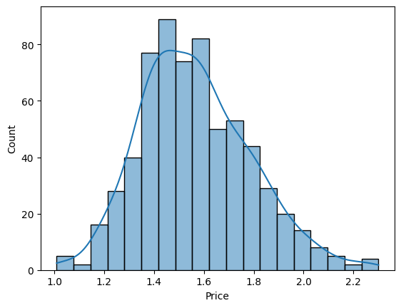
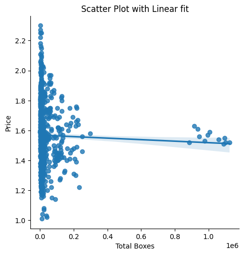
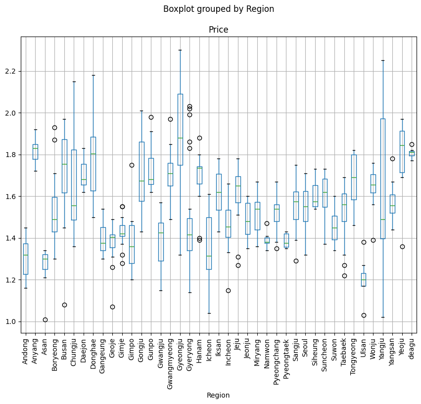
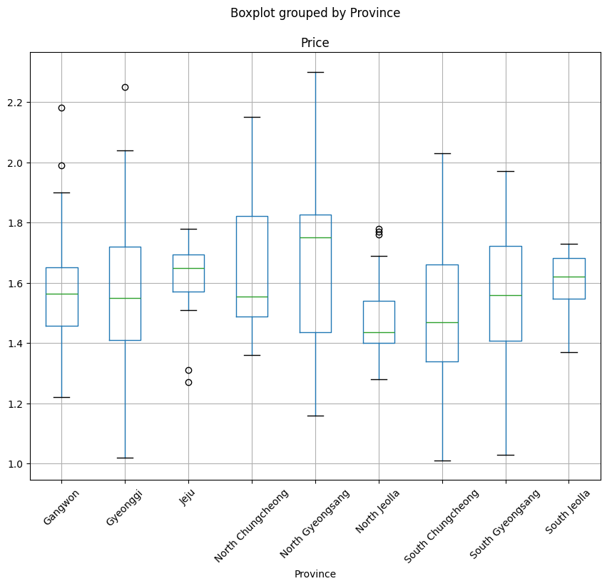

# price_prediction

## Introduction

We perform time-series forecasting. More specifically, we predict future product prices based on previously observed values and/or features. 

## Setup

First, clone this repo. Make sure you have downloaded the dataset and copied it to `data/` and have defined necessary config parameters in `src/config.yaml` (e.g. file name, feature column labels, target label, etc.).

To run the notebooks and script locally, make sure to create your environment and install the necessary dependencies running:

    pip install -r requirements.txt

## Scripts

### `train.py`

From the root directory, run

    PYTHONPATH=./ python3 src/train.py

There will be some stdout as well as files saved inside `output/` once the script is run.

If you wish to run via docker, first build the image

    docker compose build

And, second, run the script

    docker compose up

## Analysis

The presence of a few outliers skewed the distribution of price values. Binning by intervals of 500, we get:

|bin | frequency |
|---------------|------|
|(0.999, 501.0] | 643 |
|(501.0, 1001.0] | 0 |
|(1001.0, 1501.0]| 0 |
|(1501.0, 2001.0]| 0 |
|(2001.0, 2501.0]| 0 |
|(2501.0, 3001.0]| 0 |
|(3001.0, 3501.0]| 1 |
 

Once the outlier is removed, we have the following bins.

|bin | frequency |
|---------------|------|
|(0.999, 33.0]  |   642
|(33.0, 65.0]   |     0
|(65.0, 97.0]   |     0
|(97.0, 129.0]  |     0
|(129.0, 161.0] |     0
|(161.0, 193.0] |     0
|(193.0, 225.0]  |    1

Once we remove it, we we have following distribution of price values that resemble a normal distribution.

There wasn't much correlation between numeric features (i.e. Total Volume, Total Boxes, etc.) and Price. For instance, the correlation between total volume and price looked as follows:

Instead, we focused on examining any difference in means from region to region or province to province. One way to visualize the significance of t-tests is to plot boxplots as below.

## Results

For model evaluation we chose the first two months to be our train set while the third month was our test set. Upon careful observation, one can see the prices come on a weekly basis.

We trained three parametric models (linear regression, lasso, and ridge) and two non-parametric models (knearest and decision tree). As expected, the non-paramtric models overfit the data while the linear parametric models generalized much better with the linear regression model performing the best.

            lr                  lasso               ridge               dt              knn          
    metric  train     test      train     test      train     test      train test      train     test                                                                              
    mse     0.023168  0.023680  0.049156  0.046662  0.023397  0.023691  0.0   0.033231  0.008882  0.037412
    mae     0.105481  0.118599  0.177451  0.172974  0.107016  0.118628  0.0   0.133224  0.066215  0.143131
    mape    0.065531  0.075321  0.112266  0.109558  0.066583  0.075350  0.0   0.089082  0.041974  0.090252